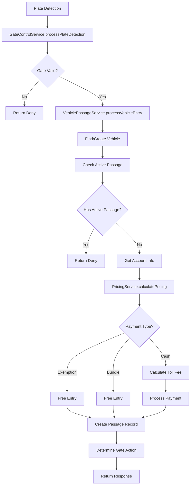
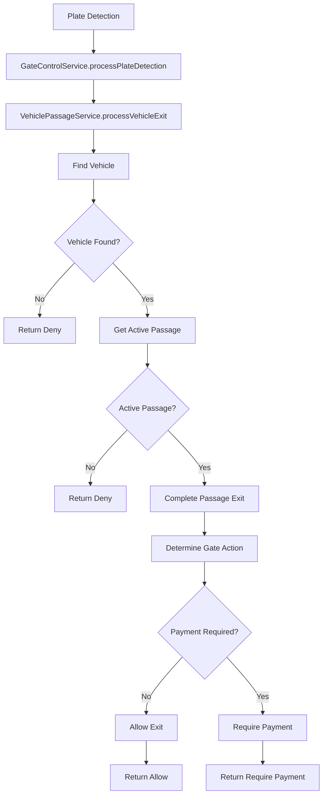

# Smart Parking System - Complete Architecture Guide

## 🏗️ System Overview

The Smart Parking System is a comprehensive toll management solution consisting of three main components:

1. **Laravel API Backend** (`smart-parking-api`) - Core business logic and data management
2. **Next.js Frontend** (`chato-smart-parking`) - Modern web interface with desktop app support
3. **Service Layer** - Three core services that handle the complete vehicle passage flow

## 🚀 System Architecture

### Backend Services Flow

```
Plate Detection → Gate Control → Vehicle Passage → Pricing → Gate Action
     ↓              ↓              ↓              ↓          ↓
GateControlService → VehiclePassageService → PricingService → Hardware
```

## 🔧 Core Services Architecture

### 1. GateControlService - The Orchestrator
**Location**: `app/Services/GateControlService.php`

**Purpose**: Main entry point for plate detection and gate control decisions.

**Key Responsibilities**:
- Validates gates (exists, active, correct type)
- Routes requests to entry/exit processing
- Determines final gate actions (open/close/deny)
- Handles manual and emergency gate control
- Provides quick plate lookups without creating passages

**Main Methods**:
```php
processPlateDetection($plateNumber, $gateId, $direction, $operatorId, $additionalData)
quickPlateLookup($plateNumber, $gateId, $direction)
manualGateControl($gateId, $action, $operatorId, $reason)
emergencyGateControl($gateId, $action, $operatorId, $emergencyReason)
```

### 2. VehiclePassageService - The Business Logic Engine
**Location**: `app/Services/VehiclePassageService.php`

**Purpose**: Handles the core business logic for vehicle entries and exits.

**Key Responsibilities**:
- Creates and manages vehicle passages
- Integrates with PricingService for cost calculations
- Handles payment processing and receipt generation
- Manages vehicle registration and account associations
- Determines gate actions based on payment status

**Main Methods**:
```php
processVehicleEntry($plateNumber, $gateId, $operatorId, $additionalData)
processVehicleExit($plateNumber, $gateId, $operatorId, $additionalData)
quickPlateLookup($plateNumber)
```

### 3. PricingService - The Pricing Engine
**Location**: `app/Services/PricingService.php`

**Purpose**: Calculates costs based on vehicle type, payment method, and account status.

**Key Responsibilities**:
- Determines payment type (Exemption, Bundle, Cash)
- Calculates pricing based on vehicle body type and station
- Handles bundle subscription logic
- Manages exemption processing

**Main Methods**:
```php
calculatePricing($vehicle, $station, $account)
determinePaymentType($vehicle, $account)
hasActiveBundleSubscription($account)
```

## 🔄 Complete Vehicle Flow

### Vehicle Entry Process



### Vehicle Exit Process



## 💰 Payment Types & Pricing Logic

### Payment Type Determination

1. **Exemption Check**: Vehicle has active exemption
2. **Bundle Check**: Account has active subscription
3. **Default**: Cash payment required

### Pricing Calculation

```php
// Exemption Pricing
[
    'amount' => 0,
    'payment_type' => 'Exemption',
    'requires_payment' => false,
    'description' => 'Exempted vehicle'
]

// Bundle Pricing
[
    'amount' => 0,
    'payment_type' => 'Bundle',
    'requires_payment' => false,
    'description' => 'Bundle subscription active'
]

// Cash Pricing
[
    'amount' => $basePrice->base_price,
    'payment_type' => 'Cash',
    'requires_payment' => true,
    'description' => 'Toll fee required'
]
```

## 🚪 Gate Control Logic

### Gate Actions

| Action | Description | When Used |
|--------|-------------|-----------|
| `open` | Allow vehicle through | Free passages, bundle subscribers, exempted vehicles |
| `deny` | Block vehicle | Invalid conditions, already active passage |
| `require_payment` | Keep gate closed until payment | Cash customers who need to pay |

### Gate Action Determination

```php
// Entry Gate Actions
if ($passage->passage_type === 'free' || $passage->passage_type === 'exempted') {
    return 'allow';
}

if ($pricing['payment_type'] === 'Bundle') {
    return 'allow';
}

if ($pricing['payment_type'] === 'Exemption') {
    return 'allow';
}

if ($pricing['payment_type'] === 'Cash' && $pricing['requires_payment']) {
    return 'require_payment';
}
```

## 🗄️ Database Models & Relationships

### Core Models

- **Vehicle**: Vehicle information and registration
- **VehiclePassage**: Entry/exit records with pricing
- **Gate**: Physical gate hardware control
- **Station**: Toll station locations
- **Account**: Customer accounts for bundle subscriptions
- **BundleSubscription**: Active subscription plans
- **Receipt**: Payment receipts for cash transactions

### Key Relationships

```php
Vehicle -> VehiclePassage (one-to-many)
Gate -> Station (belongs-to)
Account -> BundleSubscription (one-to-many)
VehiclePassage -> Receipt (one-to-one, for cash payments)
```

## 🔌 API Integration

### Frontend-Backend Communication

The Next.js frontend communicates with the Laravel backend through:

```typescript
// API Client Configuration
const API_BASE_URL = 'http://localhost:8000/api/toll-v1';

// Authentication
Authorization: Bearer YOUR_TOKEN_HERE

// Key Endpoints
POST /api/toll-v1/plate-detection
POST /api/toll-v1/vehicle-entry
POST /api/toll-v1/vehicle-exit
GET /api/toll-v1/gates/status
```

## 🖥️ Desktop Application

### Tauri Integration

The system includes a desktop application built with Tauri:

- **Cross-platform**: Windows, macOS, Linux
- **Native performance**: Rust backend with web frontend
- **Hardware integration**: Camera access, gate control
- **Offline capability**: Local data caching

### Desktop Features

- Real-time gate monitoring
- Camera interface for plate detection
- Operator dashboard
- Manager analytics
- Emergency gate control

## 🔐 Security & Authentication

### Role-Based Access Control

| Role | Permissions |
|------|-------------|
| **System Administrator** | Full system access, user management |
| **Station Manager** | Station operations, reporting |
| **Gate Operator** | Gate control, vehicle processing |

### Authentication Flow

1. User login with credentials
2. Laravel Sanctum token generation
3. Token stored in frontend
4. API requests include Bearer token
5. Role-based route protection

## 📊 Monitoring & Logging

### Comprehensive Logging

All services include detailed logging:

```php
Log::info('Vehicle entry processed', [
    'plate_number' => $plateNumber,
    'passage_id' => $passage->id,
    'gate_action' => $gateAction,
    'operator_id' => $operatorId,
    'pricing' => $pricing
]);
```

### Monitoring Features

- Real-time gate status
- Active passage tracking
- Revenue analytics
- System health monitoring
- Emergency override logging

## 🚀 Deployment Architecture

### Backend Deployment
- Laravel application with database
- Queue workers for background processing
- Redis for caching and sessions
- File storage for receipts and logs

### Frontend Deployment
- Next.js static export for web
- Tauri desktop builds for distribution
- CDN for static assets
- Environment-specific configurations

## 🔧 Development Workflow

### Service Development
1. **GateControlService**: Handle gate operations and validation
2. **VehiclePassageService**: Implement business logic
3. **PricingService**: Configure pricing rules
4. **Integration**: Test complete flow
5. **Frontend**: Update UI components

### Testing Strategy
- Unit tests for each service
- Integration tests for complete flows
- API endpoint testing
- Frontend component testing
- End-to-end testing with hardware simulation

## 📈 Performance Considerations

### Database Optimization
- Indexed queries for vehicle lookups
- Cached gate status information
- Optimized passage queries
- Connection pooling

### Caching Strategy
- Gate control status caching
- Pricing configuration caching
- User session caching
- API response caching

## 🛠️ Troubleshooting

### Common Issues

1. **Gate Not Responding**: Check gate status and hardware connection
2. **Pricing Errors**: Verify pricing configuration for vehicle types
3. **Authentication Issues**: Check token validity and user permissions
4. **Database Errors**: Verify database connections and migrations

### Debug Mode
```bash
# Enable debug logging
LOG_LEVEL=debug

# Database query logging
DB_LOG_QUERIES=true

# API request logging
API_DEBUG=true
```

## 📚 Additional Documentation

- [Authentication Guide](./AUTHENTICATION.md)
- [API Documentation](./API_OVERVIEW.md)
- [Database Schema](./DATABASE_SCHEMA.md)
- [Deployment Guide](./DEPLOYMENT.md)
- [Testing Guide](./TESTING.md)

---

**System Version**: 1.2.0  
**Last Updated**: January 2025  
**Maintainer**: Smart Parking System Team
